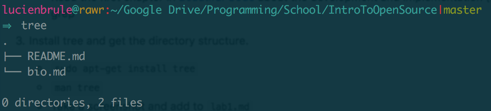

#Lab 1:
---
##D:
###1)running the tree command:
	$>tree:

##E:
###2)regex problems:

###3)regex tutorias:

##F:

###2)creating a thing on snap/blocky:

##G:
###1): A paragraph about a problem that intrests me:

paragraph goes here.

