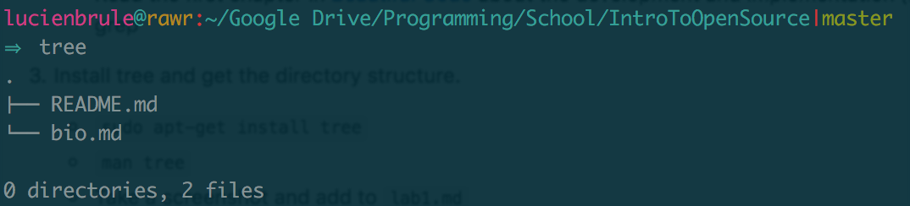
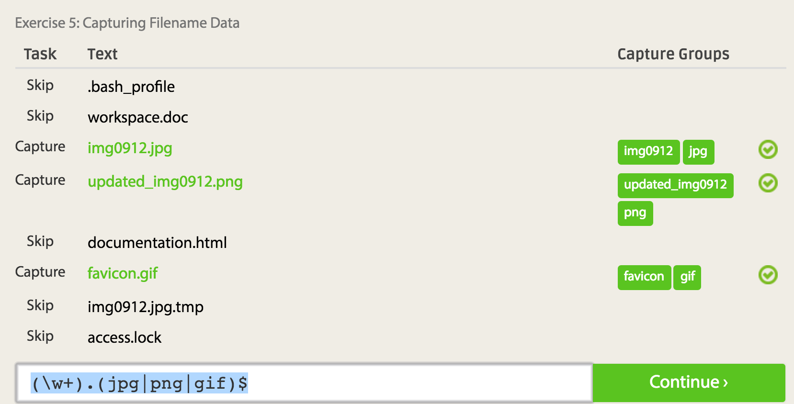
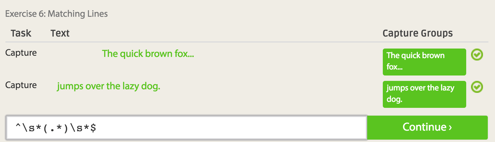
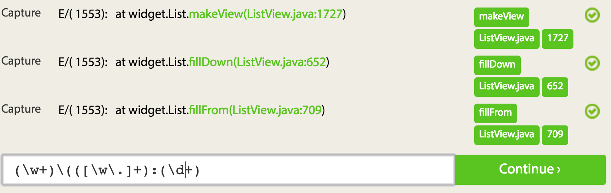
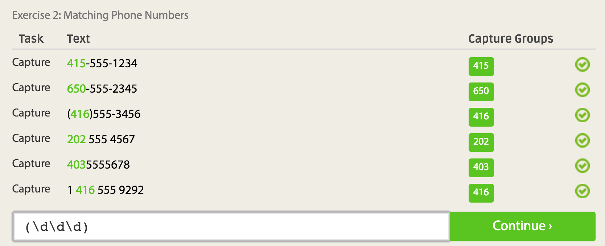
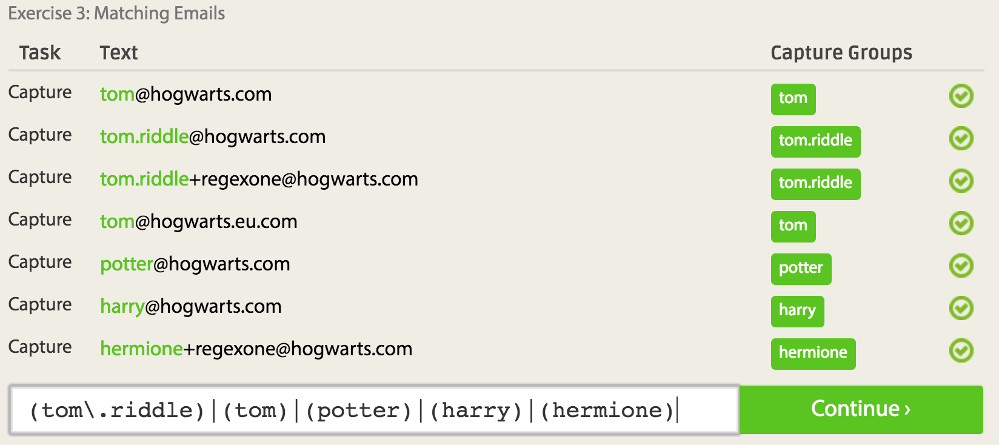
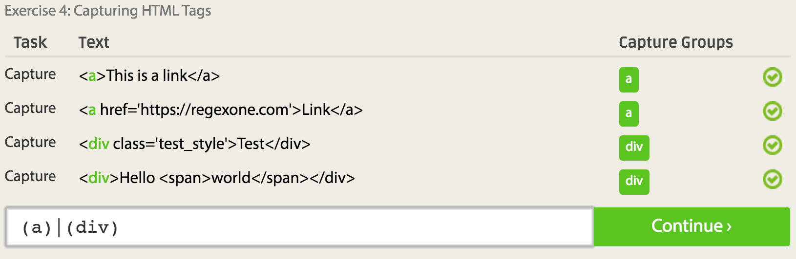
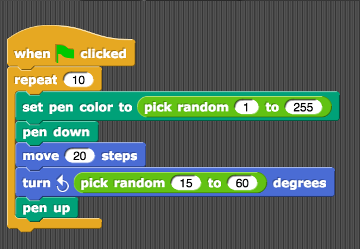

#Lab 1:
---

##C:
Please read the 10 criteria of Open Source Definition http://opensource.org/osd and understand why they are important.
- Free distrobution of source code, allow derived works, keep 
author attribution. Liscence cannot restrict other software. No descrimination.
-This is important as it provides an open forum for production, allows forking and the general environment of open source culture to exist.

Please read Eric Raymond's article Smart Questions How to ask the question The Smart Way .
-

Do you have more suggestions for How To Answer Questions in a Helpful Way (from your past experience) http://www.catb.org/esr/faqs/smart-questions.html#idp64834912
List at least two.
- Descriptive questions are beneficial to both the asker, answerer and the audience. 
- Although it was stated in the article, doing your due diligence before asking questions and providing some quoutable sources also helps when asking technical questions to provide context.

Please read chapter 3 of Free Culture http://www.free-culture.cc/freeculture.pdf
Write a short paragraph ( 8 to 10 sentences) of what you got out of reading that chapter.
- I found the chapter about the RPI student's case against the RIAA very interesting. My parents work in the movie industry and I hear about piracy and sharing legal stuff almost daily when I'm at home. I don't think that  what that student did was piracy, I feel like uploaders of infringing material should be at fault for their wrongs, not the technology developers.

##D:
###1)running the tree command:
	$>tree:

##E:
###2)regex problems:

###3)regex tutorias:

##F:

###2)creating a thing on snap/blocky:

##G:
###1): A paragraph about a problem that intrests me:

Right now I'm also taking foundations of computer science. I've found that we often have problems and suppositions dealign with discrete objects like graphs and grids. I feel like if I had a framework to tinker with the problems presented in code I would learn, and consequently solve the problems faster. I've thought about and generally looked into creating a basic js library that can quickly spin up usefull objects for representing the problems in the class.

