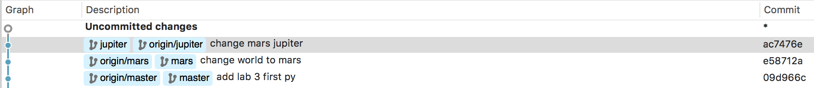

#Lab 3

##Part 1: See root of the repo.
- see first.py, included in this folder.
- see the mars branch.
- here is a visualization of the branching required:

#Part  2
-see lucienbrule/SpoonFork
- the first four levels of gitbrnaching.js: (up to rebase)
-[img](gittut.png)

#Part 3 
- Fork mskmoorthy/Fall2016PullReq.git
